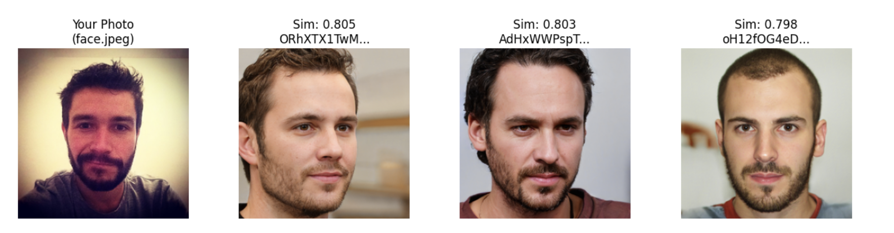
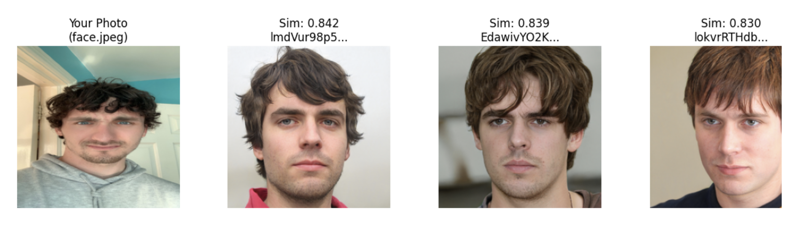

# Doppelgänger Detection

A face similarity system that finds visually similar people by adapting a pre-trained identity recognition model for similarity retrieval.

Face recognition models like ArcFace are trained to push different identities apart, but for doppelgänger detection the goal is the opposite: finding faces that look alike despite being different people. This project fine-tunes a pre-trained InsightFace model (buffalo_l, a ResNet-50 trained on WebFace600K) using triplet loss to learn visual similarity rather than identity separation.

## Approach

The model is trained on 3,000 mismatched pairs from the SLLFW dataset (different people who look similar) as positive examples, with CelebA used for negative sampling. Training follows a progressive strategy where the backbone is frozen for the first 20 epochs, then unfrozen for end-to-end fine-tuning. Embeddings are L2-normalised for cosine similarity retrieval.

## Results

Two example queries against a gallery of faces. The score under each match is the cosine similarity between the 512-D embeddings. Duplicate gallery images (the same photo stored under different filenames) have been removed from the display.





## Datasets

- **SLLFW**: 3,000 mismatched pairs used as positive examples (similar-looking, different identity)
- **HDA-Doppelgänger**: additional positive pairs (optional)
- **CelebA**: random sampling for negative pairs

## Running

```
pip install -r requirements.txt
python main.py
```

This parses the SLLFW pairs, preprocesses images to 112x112, trains the similarity model, and evaluates retrieval performance using Recall@K.

## Configuration

Training parameters can be modified in `main.py` — batch size, learning rate, number of epochs, and the epoch at which the backbone unfreezes are all configurable.
